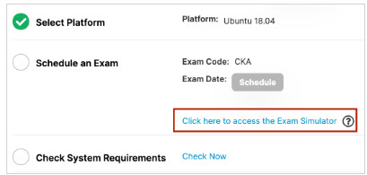

# killer.sh

Killer is the ultimate test of readiness to take the exam. In their own words:

> **This simulator is more difficult than the real certification** 
We think this gives you a greater learning effect and also confidence to score in the real exam. Most of the scenarios require good amount of work and can be considered "hard". In the real exam you will also face these "hard" scenarios, just less often. There are probably also fewer questions in the real exam.

Each question is made of a number of "sub-tasks", each completed sub-task scoring a point. At the end of the exam when you get the score, it will tell you the number of completed sub-tasks out of the total, so you can calculate a percentage from that.

The killer.sh test interface is a very close simulation of the real exam and everything in it should work very similarly.

Aim to score more than 90% with time to spare.

* You get two simulator sessions included in the price of the exam. If you want more, you must purchase them separately from `killer.sh` website, or in the event that you failed the main exam twice - when you purchase another exam. You should aim to do the first session about 2 weeks before the exam. Revise anything you find hard. Do the second session 2-3 days before your exam.
* You activate the free sessions from the [exam portal](https://trainingportal.linuxfoundation.org/). Note that the killer test does not start immediately when you click this link. You will get a confirmation dialog that you must accept before it launches the test environment.  
* Each session lasts for 36 hours from when you start it, i.e. if you activate it at 9am Monday, it lasts till 9pm Tuesday.
* Both sessions will have the same questions, unless the Kubernetes version of the exam is updated between the time you do session 1 and session 2, in which case _some_ questions _may_ change, depending on what has changed with the Kubernetes upgrade. Any questions relating to features that have been retired (e.g. PodSecurityPolicy in 1.25) are definitely replaced.
* Like the real exam, you may attempt questions in any order - e.g. leaving the hardest ones till the end. If there is any dependency between questions, it will be stated in the question.
* You may close the site or even switch off your machine during that 36 hours. For quick re-access, save the URL of your session from the browser address bar. It looks like `https://killer.sh/attendee/229b6e26-1495-4646-ac93-9503f49a8c3a`.
* During the 36 hours, you may restart and re-do the test as many times as you like - simply use the `Exam Controls` menu and select `Restart Session`. This is highly encouraged!
* At the end of the two hour test duration, a link to the solutions and score page appears at the top of the question pane.
* If you finish early, you can end the test by selecting `Solutions & Score` from the `Exam Controls` menu. This will set the timer to zero before displaying the link to the solutions and score pages.
* When timer is at zero you can still do things in the environment but any questions answered after timer is at zero are not scored.
* Note that the score is recalculated every few minutes. When you end the test, the score for the last question you answered before ending might not be calculated. Wait 5 minutes, then refresh the score page.
* If you pass the real exam without having used both killer sessions, any remaining sessions are still available to you.
* You may ask about questions in killer.sh on KodeKloud slack/community forum. NDA applies only to questions from real exams.

See also
* [Complete killer.sh FAQ](https://killer.sh/faq)
* [Exam Environment Simulation](https://killercoda.com/kimwuestkamp/scenario/cks-cka-ckad-remote-desktop) - This is free and on Killer's killercoda site. Sign up with social media. Note that this is only the desktop VDI - it does not have the sidebar/top bar etc. You can use this to practice keyboard shortcuts and customizing your environment. If you explore the killercoda site you will also find more practice questions in a lab environment similar to KodeKloud's.

[Return to main FAQ](../README.md)